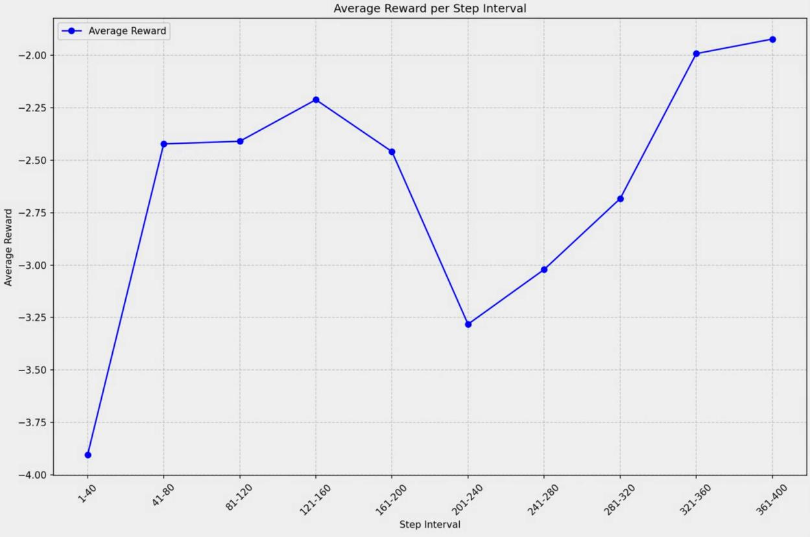

# adaGRPO: More Efficient, Stable, and Memory-Friendly Adaptive GRPO Training Method

⭐ **If you find this project useful, please give it a star. Thank you!** ⭐

[简体中文](README_CN.md) | [English](README.md)

---

## 📑 Table of Contents

- [adaGRPO: More Efficient, Stable, and Memory-Friendly Adaptive GRPO Training Method](#adagrpo-more-efficient-stable-and-memory-friendly-adaptive-grpo-training-method)
  - [📑 Table of Contents](#-table-of-contents)
  - [I. Algorithm Overview](#i-algorithm-overview)
    - [GRPO Summary](#grpo-summary)
    - [adaGRPO Improvements](#adagrpo-improvements)
    - [adaGRPO Solution](#adagrpo-solution)
  - [II. File Structure](#ii-file-structure)
  - [III. Usage](#iii-usage)
    - [1. Install Dependencies](#1-install-dependencies)
    - [2. Prepare Model and Dataset](#2-prepare-model-and-dataset)
    - [3. Start Training](#3-start-training)
    - [4. Evaluation](#4-evaluation)
  - [IV. References](#iv-references)
  - [Notes](#notes)

---

## I. Algorithm Overview

### GRPO Summary

**GRPO (*Group Relative Policy Optimization*)** is a reinforcement learning algorithm proposed by the **DeepSeek** team, based on **PPO (*Proximal Policy Optimization*)**.

* **PPO** uses a value model of the same size as the policy model to compute relative advantage $A$ from sampled rewards $R$.
* **GRPO** removes the value model. It samples a group of outputs $O$, then computes the mean and variance of rewards within the group to estimate the relative advantage $A$. This reduces memory and computation costs.

Diagram:


---

### adaGRPO Improvements

**adaGRPO (adaptive GRPO)** addresses two main issues:

1. **Fixed `num_generations` parameter**

   * Larger value → better results, but higher compute and memory usage.
   * Ideal case:

     * Simple tasks → use small `num_generations` to save resources.
     * Hard tasks → use large `num_generations` to improve the chance of high-quality answers.

2. **Fixed sampling parameters**

   * Simple tasks → conservative sampling ensures stability.
   * Hard tasks → aggressive sampling explores more solutions.

---

### adaGRPO Solution

* Introduces **adaptive sampling count and parameters**.
* If a group of sampled outputs does not meet the condition (in experiments: none contains the correct answer):

  1. Cache mean and variance of rewards.
  2. Resample with more aggressive parameters.
  3. Once the condition is met, compute the advantage $A$ using cached values and update the policy model.
  4. Reset sampling parameters for the next iteration.

Comparison:


*Figure: adaGRPO workflow. "Dynamic Sample" part refers to Note 2.*


*Figure: GRPO average reward curve.*


*Figure: adaGRPO average reward curve.*


*Figure: Accuracy comparison on test set, experiment setup in Note 1.*

---

## II. File Structure

* `adaGRPO/AdaGRPOTrainer.py`
  Implements adaGRPO training logic, extending Hugging Face `trl`'s `GRPOTrainer`.

* `adaGRPO/AdaGRPOTrainWithLoraManager.py`
  Wraps the training process, compatible with GRPO.
  Key functions:

  * `init_base()` – initialize model, LoRA, and dataset.
  * `init_GRPO()` – initialize trainer.
  * `train()` – run training.

* `adaGRPO/AdaLogitsProcessor.py`
  Defines **adaLogitsProcessor**:

  * Thinking stage → aggressive sampling speeds up convergence.
  * Final output → conservative sampling ensures stability.
  * Usable independently of `AdaGRPOTrainer`.

* `LLMRLV6Math.py`
  Training script and reward functions, adapted from
  [unsloth’s GRPO tutorial](https://colab.research.google.com/github/unslothai/notebooks/blob/main/nb/Qwen3_%2814B%29-Reasoning-Conversational.ipynb).

* `EasyChatLLM.py`
  Simple chat GUI. Supports LoRA checkpoint loading, saving conversation, and generating `config.json`.

* `EvaluateLLM.py`, `CheckEvalResMath.py`
  Scripts for evaluating training results.

---

## III. Usage

### 1. Install Dependencies

```bash
pip install -r requirements.txt
```

### 2. Prepare Model and Dataset

* Model: [Qwen3-1.7B](https://huggingface.co/Qwen/Qwen3-1.7B)
* Dataset: [DAPO-MATH-17k](https://huggingface.co/datasets/BytedTsinghua-SIA/DAPO-Math-17k)

Modify paths in `LLMRLV6Math.py` accordingly.

### 3. Start Training

```bash
python LLMRLV6Math.py
```

### 4. Evaluation

* GUI test:

  ```bash
  python EasyChatLLM.py
  ```

* Run `EvaluateLLM.py` for evaluation.

---

## IV. References

1. [DeepSeekMath: Pushing the Limits of Mathematical Reasoning in Open Language Models](https://arxiv.org/abs/2402.03300)
2. [unsloth GRPO Training Tutorial](https://colab.research.google.com/github/unslothai/notebooks/blob/main/nb/Qwen3_%2814B%29-Reasoning-Conversational.ipynb)
3. [Qwen3-1.7B](https://huggingface.co/Qwen/Qwen3-1.7B)
4. [DAPO-MATH-17k](https://huggingface.co/datasets/BytedTsinghua-SIA/DAPO-Math-17k)

---

## Notes

**Note 1**
Training setup: Qwen3-1.7B on DAPO-MATH-17k.
LoRA adapter with rank=16, trained 400 steps on a single 5060Ti (16GB).
Test dataset size = 300. Both experiments used `num_generations=8`, max generation tokens=8192.

* adaGRPO enabled adaptive mechanism after 200 steps:

  * Steps 200–300 (low avg. reward): 64 resamples.
  * Steps 300–400 (higher avg. reward): 37 resamples.
  * Memory usage similar to GRPO with fixed `num_generations`.
* GRPO failed to converge after ~200 steps. Likely reason: fixed sampling insufficient for hard tasks, advantage regularization amplified noise, leading to incorrect optimization.

**Note 2**
In the diagram, only the *Adjust Sample Param* part of **Dynamic Sample** is essential.
Other details are author-specific optimizations for formatted or stable outputs.
Further description of `adaLogitsProcessor` will be provided separately.
