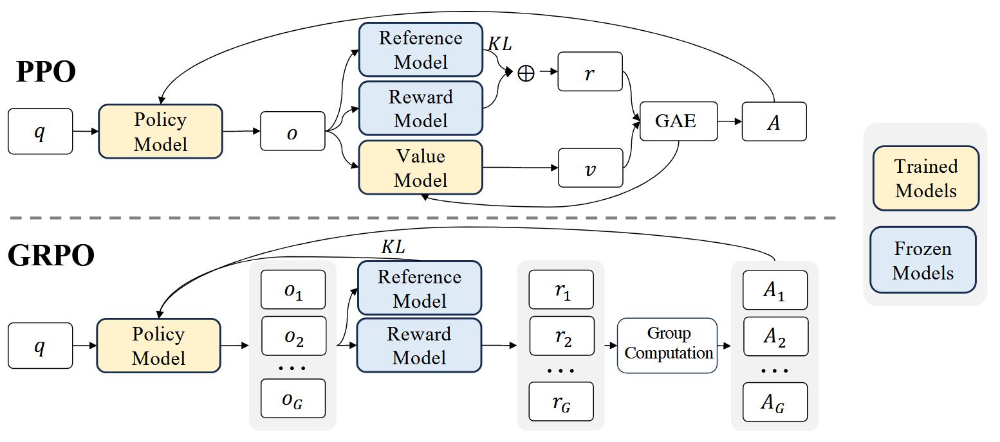
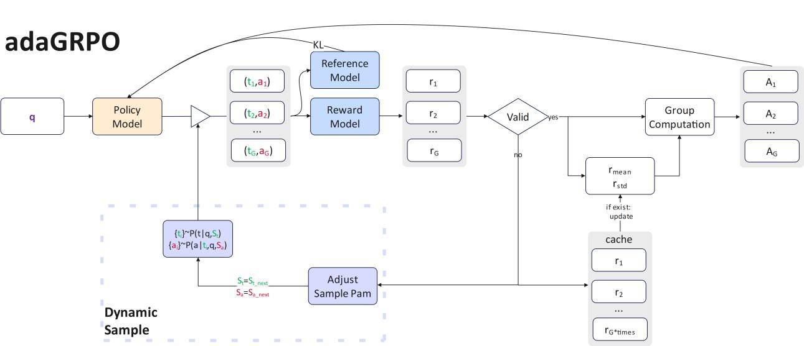
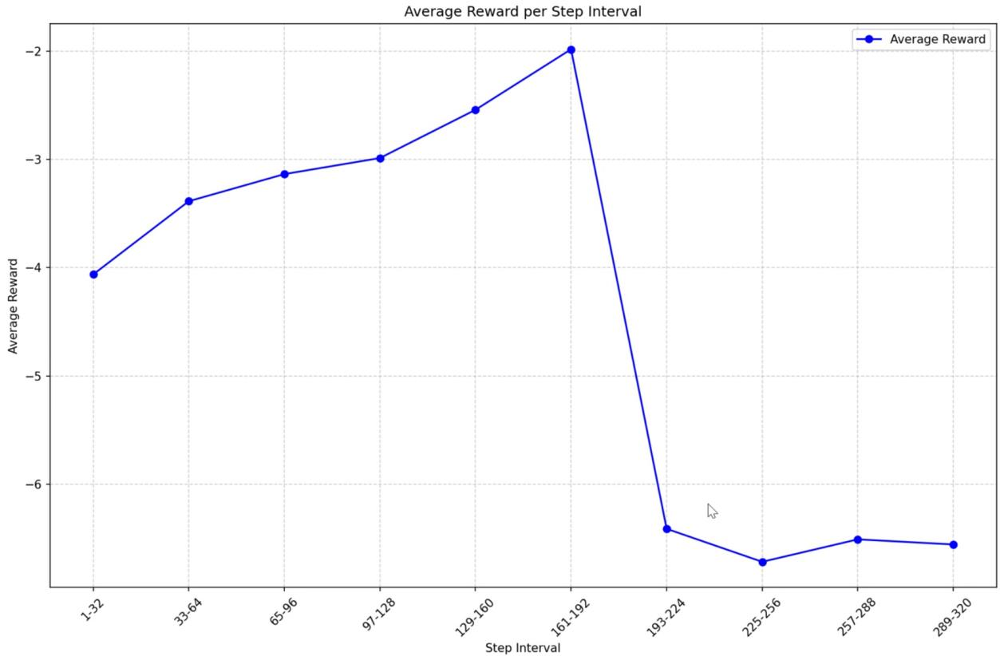
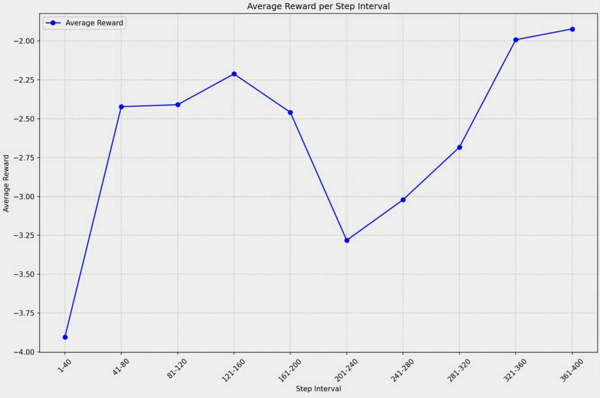
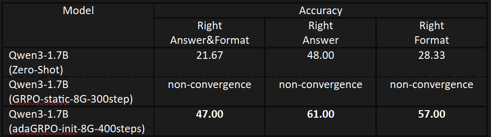

# adaGRPO：更高效、稳定、显存占用更小的自适应 GRPO 强化训练方法

⭐ **如果觉得很赞，请给本仓库点一个 star，谢谢！** ⭐

[简体中文](README_CN.md)|[English](README.md)

---

## 📑 目录

- [adaGRPO：更高效、稳定、显存占用更小的自适应 GRPO 强化训练方法](#adagrpo更高效稳定显存占用更小的自适应-grpo-强化训练方法)
  - [📑 目录](#-目录)
  - [I. 算法介绍](#i-算法介绍)
    - [GRPO 简述](#grpo-简述)
    - [adaGRPO 改进点](#adagrpo-改进点)
    - [adaGRPO 解决方案](#adagrpo-解决方案)
  - [II. 文件结构](#ii-文件结构)
  - [III. 运行](#iii-运行)
    - [1. 安装依赖](#1-安装依赖)
    - [2. 准备模型和数据集](#2-准备模型和数据集)
    - [3. 启动训练](#3-启动训练)
    - [4. 测试评估](#4-测试评估)
  - [IV. 参考工作](#iv-参考工作)
  - [注释](#注释)

---

## I. 算法介绍

### GRPO 简述

**GRPO（*Group Relative Policy Optimization*）** 是 DeepSeek 团队提出的一种基于 **PPO（*Proximal Policy Optimization*）** 的改进型强化学习算法。

* **PPO** 使用一个与策略模型大小相同的价值模型表示基准，并计算采样奖励 $R$ 的相对优势 $A$。
* **GRPO** 去掉了价值模型，通过采样一组输出 $O$，计算组内奖励均值和方差来求相对优势 $A$，减少了显存和计算资源的消耗。

流程图如下：



---

### adaGRPO 改进点

**adaGRPO (adaptive GRPO)** 针对以下两个问题进行优化：

1. **固定的 `num_generations` 参数**

   * 值大 → 效果好，但计算和显存开销大。
   * 理想情况：

     * 简单任务 → 使用小 `num_generations`，节省资源。
     * 困难任务 → 使用大 `num_generations`，提升得到优质解答的概率。

2. **固定的采样参数**

   * 简单任务 → 使用保守采样参数，保证稳定性。
   * 困难任务 → 使用激进采样参数，探索更多解法。

---

### adaGRPO 解决方案

* 引入 **自适应采样个数与参数**。
* 当一组采样输出不满足条件（实验中条件为：没有输出包含正确答案）时：

  1. 缓存奖励均值与方差；
  2. 使用更激进的采样参数重新采样；
  3. 满足条件后，结合缓存值计算优势函数 $A$ 并更新策略模型；
  4. 重置采样参数进入下一次迭代。

对比如下：


*图：adaGRPO 算法流程图，Dynamic Sample 部分参考注 2*


*图：GRPO 平均奖励变化曲线*


*图：adaGRPO 平均奖励变化曲线*


*图：训练后在测试集上的准确率对比，实验设置参考注1*

---

## II. 文件结构

* `adaGRPO/AdaGRPOTrainer.py`

  * 实现 adaGRPO 训练逻辑，基于 Hugging Face `trl` 库中的 `GRPOTrainer`。

* `adaGRPO/AdaGRPOTrainWithLoraManager.py`

  * 封装训练流程，兼容 GRPO。
  * 核心函数：

    * `init_base()` 初始化模型、LoRA、数据集。
    * `init_GRPO()` 初始化 trainer。
    * `train()` 执行训练。

* `adaGRPO/AdaLogitsProcessor.py`

  * 提出 **adaLogitsProcessor**：

    * 思考阶段 → 激进采样参数，加快收敛。
    * 最终输出 → 保守采样参数，保证稳定性。
  * 可独立于 `AdaGRPOTrainer` 使用。

* `LLMRLV6Math.py`

  * 实验训练代码，奖励函数等参考
    [unsloth 的 GRPO 教程](https://colab.research.google.com/github/unslothai/notebooks/blob/main/nb/Qwen3_%2814B%29-Reasoning-Conversational.ipynb)。

* `EasyChatLLM.py`

  * 简易聊天 GUI，支持加载 LoRA checkpoint、保存对话、生成 `config.json`。

* `EvaluateLLM.py`, `CheckEvalResMath.py`

  * 用于评估训练效果。

---

## III. 运行

### 1. 安装依赖

```bash
pip install -r requirements.txt
```

### 2. 准备模型和数据集

* 模型：[Qwen3-1.7B](https://huggingface.co/Qwen/Qwen3-1.7B)
* 数据集：[DAPO-MATH-17k](https://huggingface.co/datasets/BytedTsinghua-SIA/DAPO-Math-17k)

修改 `LLMRLV6Math.py` 文件开头的路径配置。

### 3. 启动训练

```bash
python LLMRLV6Math.py
```

### 4. 测试评估

* GUI 测试：

  ```bash
  python EasyChatLLM.py
  ```
* 效果评估：运行 `EvaluateLLM.py`。

---

## IV. 参考工作

1. [DeepSeekMath: Pushing the Limits of Mathematical Reasoning in Open Language Models](https://arxiv.org/abs/2402.03300)
2. [unsloth 的 GRPO 训练教程](https://colab.research.google.com/github/unslothai/notebooks/blob/main/nb/Qwen3_%2814B%29-Reasoning-Conversational.ipynb)
3. [Qwen3-1.7B](https://huggingface.co/Qwen/Qwen3-1.7B)
4. [DAPO-MATH-17k](https://huggingface.co/datasets/BytedTsinghua-SIA/DAPO-Math-17k)

---

## 注释

**注 1**
训练模型为 Qwen3-1.7B，数据集为 DAPO-MATH-17k。
使用 r=16 的 LoRA 适配器在一张 5060Ti（16GB）上训练，共 400 步。
测试数据集大小为 300。两实验 `num_generations=8`，最大生成 token=8192。

* adaGRPO 在 200 步以后启用自适应机制：

  * 200–300 步（平均奖励较低）：重采样 64 次
  * 300–400 步（平均奖励较高）：重采样 37 次
  * 显存占用与相同 `num_generations` 的 GRPO 无明显差异。
* GRPO 在约 200 步后模型无法收敛，推测原因：处理困难任务时，固定采样数不足，优势函数正则化放大了微小差异，导致模型拟合方向错误。

**注 2**
流程图中的 **Dynamic Sample** 部分仅需关注 *Adjust Sample Param*。
其余部分为作者在输出需要格式化或较稳定时的优化。
后续 `adaLogitsProcessor` 会单独介绍。
